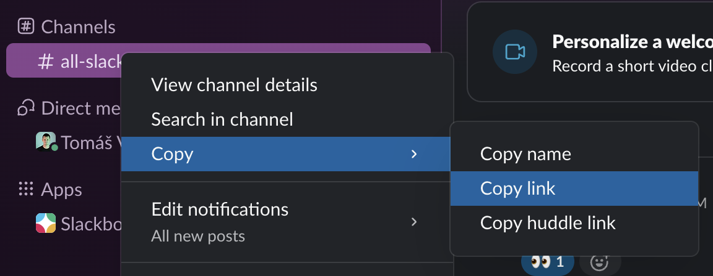

# gh-slackdump

A [GitHub CLI](https://cli.github.com/) extension that dumps Slack conversations into Slack's [JSON export format](https://slack.com/help/articles/220556107-How-to-read-Slack-data-exports) using [slackdump](https://github.com/rusq/slackdump). Inspired by [gh-slack](https://github.com/rneatherway/gh-slack), but can export entire channels and DMs, not just threads.

It authenticates via the Slack desktop app's local cookie storage, using the same approach as [gh-slack](https://github.com/rneatherway/gh-slack). Requires the Slack desktop app to be installed and signed in to your Slack workspace. Works on macOS and Linux.

## Installation

```
gh extension install wham/gh-slackdump
```

To update to the latest version:

```
gh extension upgrade wham/gh-slackdump
```

## Usage

Sign in to your Slack workspace in the **Slack desktop app** first.

```
gh slackdump <slack-link>
```

Supports channels, threads, and direct messages in both regular (`*.slack.com`) and enterprise (`*.enterprise.slack.com`) workspaces. Copy the link from Slack and pass it as the argument.



The output is written to stdout by default. Use `-o` to write to a file instead.

### Examples

```
gh slackdump https://myworkspace.slack.com/archives/C09036MGFJ4
gh slackdump -o output.json https://myworkspace.enterprise.slack.com/archives/CMH59UX4P
gh slackdump --test
```

### Flags

| Flag | Description |
|---|---|
| `-o, --output <file>` | Write JSON output to a file instead of stdout. When set, progress is logged to stdout. |
| `--test` | Show the detected Slack desktop cookie, then exit. Useful for verifying that cookie access is working. |
| `-v, --version` | Print the version number and exit. |
| `-h, --help` | Show help with all available flags and usage examples. |

## Output format

The output follows [Slack's export format](https://slack.com/help/articles/220556107-How-to-read-Slack-data-exports) with slackdump extensions:

```json
{
  "channel_id": "C09036MGFJ4",
  "thread_ts": "1771747003.176409",  // only present for thread links
  "name": "channel-name",
  "messages": [
    {
      "type": "message",
      "user": "U09036M8VEU",
      "text": "Hello",
      "ts": "1771747003.176409",
      "reactions": [{ "name": "eyes", "count": 1, "users": ["U09036M8VEU"] }],
      "slackdump_thread_replies": [
        { "type": "message", "user": "U09036M8VEU", "text": "Reply", "ts": "..." }
      ]
    }
  ]
}
```

Thread replies are nested under `slackdump_thread_replies` on the parent message. Users are identified by ID, not display name.

## Development & Releasing

Build and run locally (requires Go 1.21+):

```
scripts/run <slack-link>
```

Run tests:

```
scripts/test
```

Releases are automated with [GoReleaser](https://goreleaser.com/) via GitHub Actions. To publish a new version:

```
scripts/release patch   # v0.2.0 → v0.2.1
scripts/release minor   # v0.2.0 → v0.3.0
scripts/release major   # v0.2.0 → v1.0.0
```

The script reads the latest git tag, bumps the version, and pushes the new tag after confirmation. The workflow then builds macOS binaries (amd64 + arm64) and creates a GitHub Release, enabling `gh extension install` without requiring Go.